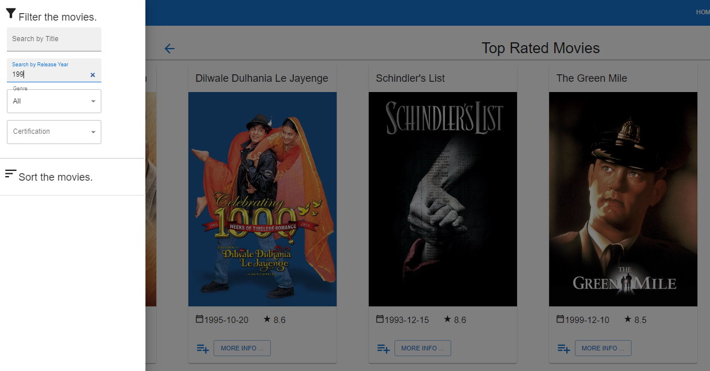
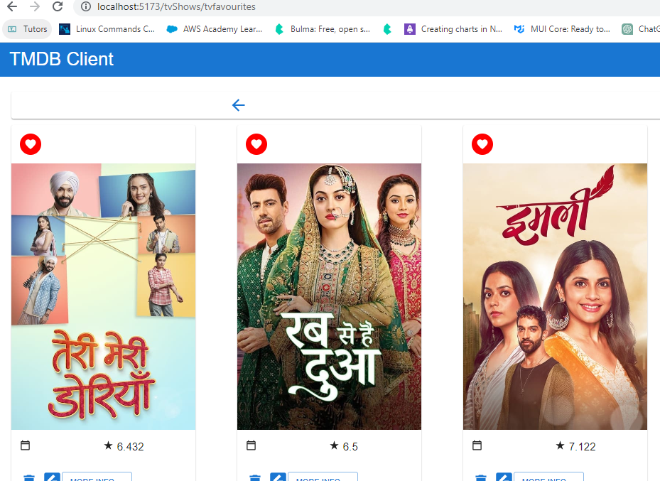
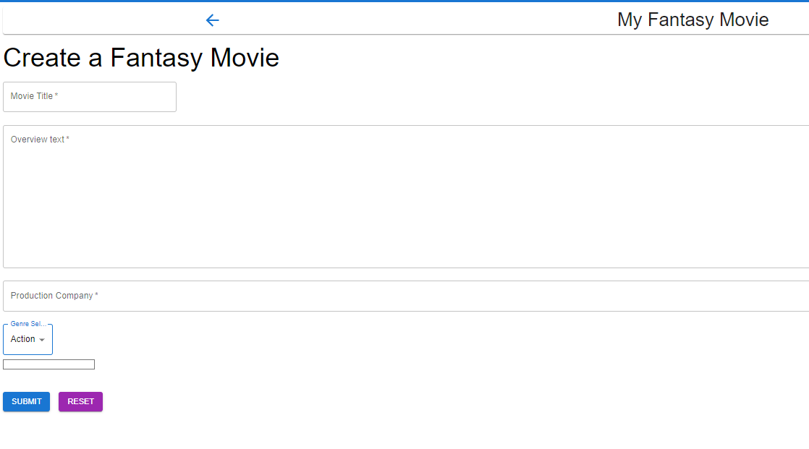
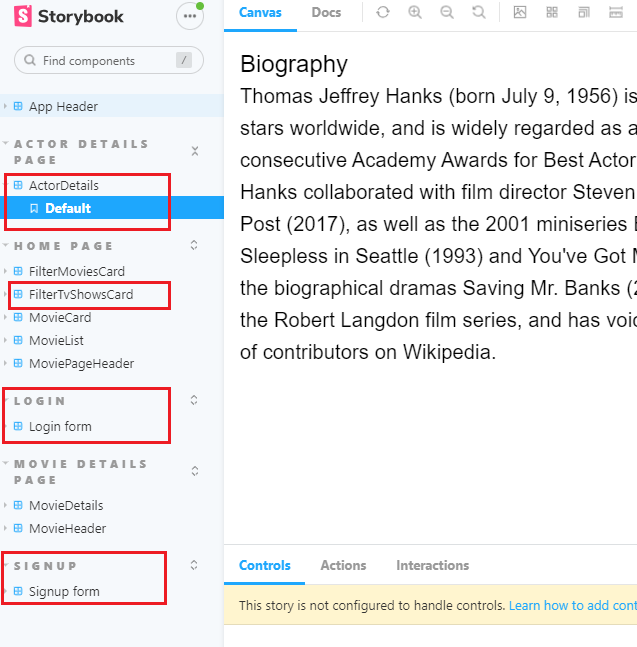

# Full Stack Development 2 - Assignment.

**Name:** Ellen Cooney

## Features.

**Complete**

- Top Rated Movies List.
- Tv Shows List.
- Filter by Release Year
- Cast list added to Movie Details in card form
- Actor Details hyperlinked from cast card
- Pagination on Movies, Tv Shows, and Upcoming Movies
- Favourite TV shows - adding and deleting, and page to display
- Sign up and login functionality supported by Supabase
- Two site headers based on whether user is logged in
- Protected routes for logged in users

**Incomplete/Partially implemented**

- Filter by Certification
- Fantasy movie form
- Tv Show Details

## Feature Design.

**Complete**

#### Tv Shows List.

> Lists tv shows from the TMDB endpoint.

#### Top Rated Movies.

> Lists all the top rated movies from the top rated TMDB endpoint.

#### Filter By Release Year.

> Users can filter movies by entering a release year (entering 199 will narrow it down to all 90s movies).

#### Cast List on Movie Page.

> Cast cards for each cast member for the associated movie.

#### Actor Details page.

> Access the cast member details through a link in their cast card.

#### Pagination for Tv Show and Movie Lists.

> 100 pages of tv shows and movies available.

 | 

#### Favourite TV Show function and page.

> Ability to add a favourite tv show.

> A view of all favourite tv shows.

#### Sign up and login functionality.

> Page to register for the site

> Page to login with hyperlink to signup page for unregistered users

#### Different site header with protected routes for logged in user.

> Public site header

> Logged in user site header

**Incomplete**

#### Tv Show Details page.

> Page is live but seasons function is not working

#### Filter by Certification.

> Not functioning - brought list of US certs into app but couldn't link to associated movie.

#### Add fantasy movie.

> Not functioning - sometimes throws an error that needs to be forced through. Takes list of genres from TMDB endpoint, and date/calendar function is broken. Form can be filled in but info is not displayed.

## Storybook.

> Storybook Overview with new stories highlighted in red

## Authentication.

> Authentication implemented using supabase to validate users, and store registered user information - see Supabase section below

#### Public routes

- / (homepage with list of movies from tmdb endpoint)
- /tvshows (homepage with list of tv shows from tmdb endpoint)
- /login (allows users to login)
- /signup (allows unregistered users to signup)

#### Protected routes

- /movies/:id (provides details for any movie)
- /movies/upcoming (lists upcoming movies)
- /movies/toprated (lists top rated movies)
- /reviews/:id (provides details and full text of a review)
- /reviews/form (allows users to submit a review)
- /fantasymovie (allows users to submit their fantasy movie) NB: function is broken
- /tvshows/:id (provides details for any tv show)
- /actor/:id (provides details for an actor from a movie cast)
- /movies/favourites (shows a logged in user's favourite movies)
- /tvShows/tvfavourites (shows a logged in user's favourite tv shows)

#### Supabase (if relevant)

